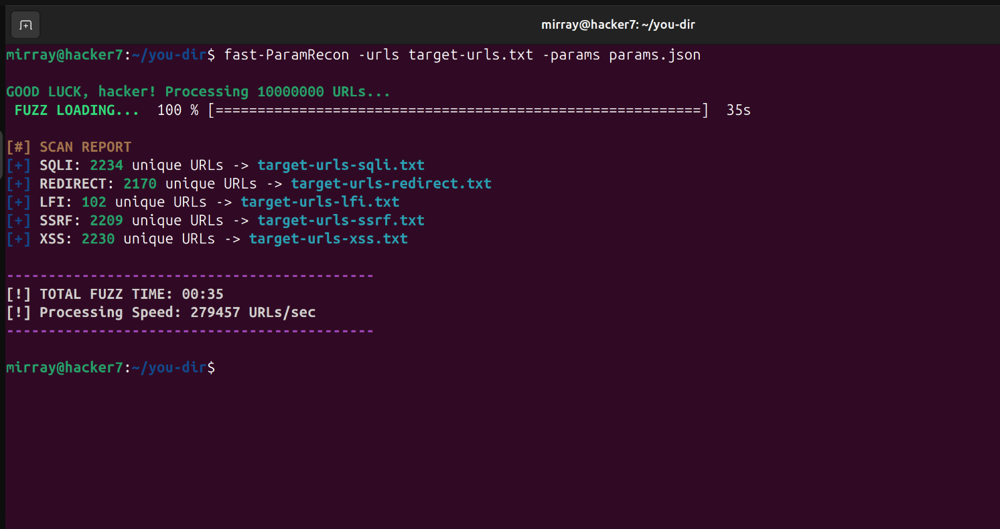

# fast-ParamRecon

Search URLs for parameters to identify specific vulnerabilities "RCE, XSS, SQLI, REDIRECT, LFI, SSRF"
Can scan 10 million URLs in under 2 minutes "Based on the OWASP Top 25 Parameters"

- 🔥 Extremely fast (optimized for large URL lists)
- 🎯 Focused on security-relevant parameters
- 📄 Uses external parameter wordlists (JSON)
- 🛠 Perfect to combine with tools like:
  - nuclei
  - sqlmap
  - custom scripts
♠️

> ### 🛠️ Installation
> 
> ```bash
> go install github.com/hackerx7853/fast-ParamRecon@latest
> ```
> ### 📋 Download Parameters
> 
> The tool uses an external parameter list (`params.json`).
> 
> ```bash
> curl -O https://raw.githubusercontent.com/hackerx7853/fast-ParamRecon/main/params.json
> ```
> ###  Usage
> 
> ```bash
> fast-ParamRecon -urls your_urls.txt -params params.json
> ```

# fast-ParamRecon ⚡


